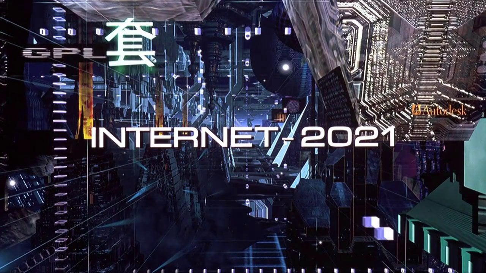

## Nemonic


Another browser based around Electron, Zeronet, Beaker, Ory Editor, etc.


### Why?

- January 17th 2021 is fast approaching. :)
- Where's the Cyberpucked 3D Web we were hoping for?
- VR HUDs and gloves are nearly here.


### Sample

<div align="center">
  <br><br>
</div>


### Todo

- [x] integrate Beaker
- [ ] integrate Zeronet/Ory/etc
- [ ] 3D interface


### What's new?

- Nothing much yet.


### Install


```
git clone https://github.com/kustomzone/Nemonic.git
cd Nemonic
npm install && npm start
```

### About

http://www.thefreedictionary.com/Nemonic


#### Thank you!

 - Github and the rest of the team working on Electron.

 
License
-------

- Kustomzone Production, MIT license.
- Contact: nemonic @ kustomzone.com

¬